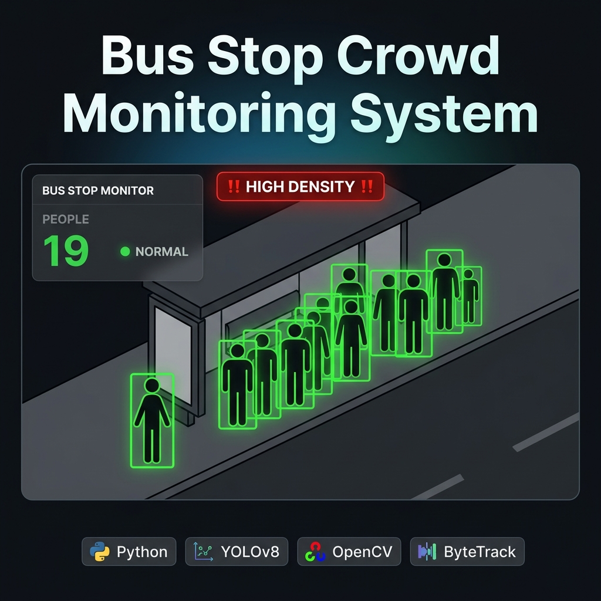

# Bus Stop Crowd Monitoring System

A beginner-friendly Python project that uses **AI (YOLOv8)** to detect and track people at a bus stop in real time. It counts the crowd, raises alerts when it gets too large or someone waits too long, and saves an annotated output video.


---

## What It Does

- 🎯 **Detects people** in a video using the YOLOv8 AI model
- 🔢 **Counts the crowd** and shows it live on screen with a color-coded panel
- 🆔 **Tracks each person** across frames with a unique ID (ByteTrack)
- ⏱ **Detects long waits** — flags anyone standing still for too long
- 🚨 **Raises alerts** when the crowd is too large or someone is waiting too long
- 📸 **Saves screenshots** every time an alert fires
- 📝 **Logs events** to a CSV file for later review
- 🎥 **Saves an annotated video** with bounding boxes, IDs, and a live HUD

---

## Project Structure

```
Bus Stop Crowd Monitoring System/
│
├── main.py             ← Run this file to start the program
├── config.yaml         ← All settings (model, thresholds, paths)
├── requirements.txt    ← Python packages to install
├── utils.py            ← Shared helper functions
│
├── source/             ← All the module source files
│   ├── tracker.py          # Detects & tracks people (YOLOv8 + ByteTrack)
│   ├── crowd_analyzer.py   # Counts people, detects who is waiting
│   ├── alert_manager.py    # Raises HIGH DENSITY and LONG WAIT alerts
│   ├── annotator.py        # Draws boxes, info panel, and alert banner
│   ├── video_writer.py     # Saves annotated frames as MP4
│   ├── evidence_store.py   # Saves JPEG screenshots on alerts
│   └── csv_reporter.py     # Writes alert events to a CSV log
│
├── models/             ← AI model weights go here
│   └── yolov8n.pt          # Auto-downloaded on first run
│
├── assets/             ← Images used in the README
│   └── banner.png
│
└── data/               ← All data (input videos + output results)
    ├── input/              # Put your videos here
    │   └── your_video.mp4
    └── output/             # Results saved here (auto-created)
        ├── snapshots/          # Alert screenshots (.jpg)
        ├── reports/            # Event logs (.csv)
        └── videos/             # Annotated output videos (.mp4)
```

---

## Setup

### Step 1 — Install Python packages

Make sure you have **Python 3.8 or newer**, then run:

```bash
pip install -r requirements.txt
```

> The YOLOv8 model (`models/yolov8n.pt`, ~6 MB) is downloaded automatically the first time you run the program.

### Step 2 — (Optional) Enable GPU

If you have an NVIDIA GPU, install the CUDA version of PyTorch **before** the step above:

```bash
pip install torch torchvision --index-url https://download.pytorch.org/whl/cu118
```

---

## How to Run

Drop your video file(s) into the `data/input/` folder, then run:

```bash
# Process all videos in data/input/
python main.py

# Process one specific video
python main.py --source data/input/my_video.mp4

# Run without showing the preview window
python main.py --no-preview

# Preview only — don't save any output files
python main.py --dry-run

# Force CPU inference
python main.py --device cpu
```

### Keyboard shortcut (during preview)

| Key | Action |
|-----|--------|
| `Q` or `Esc` | Stop and exit |

---

## Configuration (`config.yaml`)

Open `config.yaml` to tweak any setting. Each setting has a comment explaining it.

| Setting | Default | What it does |
|---|---|---|
| `model` | `models/yolov8n.pt` | Model to use — `n` (fastest) → `x` (most accurate) |
| `confidence_threshold` | `0.40` | Min confidence to count a detection |
| `iou_threshold` | `0.45` | Controls removal of overlapping boxes |
| `crowd_alert_threshold` | `15` | People count that triggers HIGH DENSITY alert |
| `waiting_time_threshold` | `30` | Seconds of stillness before LONG WAIT alert |
| `alert_cooldown_seconds` | `60` | Gap before the same alert can fire again |
| `stationary_pixel_threshold` | `25` | Max pixels of movement to be "stationary" |
| `save_video` | `true` | Save the annotated output video |
| `snapshot_on_alert` | `true` | Save a screenshot each time an alert fires |
| `show_preview` | `true` | Show live window while processing |
| `preview_width / height` | `1280 / 720` | Preview window size |

---

## Alerts

| Alert | When it fires | Severity |
|---|---|---|
| `HIGH DENSITY` | Crowd count ≥ threshold (default: 15) | ⚠️ WARNING |
| `HIGH DENSITY` | Crowd count ≥ 1.5× threshold (22+) | 🔴 CRITICAL |
| `LONG WAIT` | Anyone stationary for ≥ 30 seconds | ⚠️ WARNING |

Each alert has a **60-second cooldown** so it doesn't spam every frame.

---

## What You See on Screen

| Element | Description |
|---|---|
| **Colored bounding box** | 🟢 Green = low · 🟡 Yellow = moderate · 🔴 Red = high crowd |
| **`#ID` label** | Track number shown above each person's box |
| **Info panel** (top-left) | Live people count + status (NORMAL / MODERATE / CROWDED) |
| **Alert banner** (top-center) | Flashing red banner when an alert is active |

---

## Output Files

After processing, results appear in `data/output/`:

```
data/output/
├── snapshots/   snapshot_20240723_HIGH_DENSITY_frame000432.jpg
├── reports/     report_2024-07-23_<run-id>.csv
└── videos/      output_20240723_my_video.mp4
```

### CSV log columns

| Column | Description |
|---|---|
| `wall_time` | Real clock time when the alert fired |
| `video_time` | Position in the video (seconds) |
| `frame_no` | Frame number |
| `alert_type` | `HIGH_DENSITY` or `LONG_WAIT` |
| `severity` | `WARNING` or `CRITICAL` |
| `crowd_count` | Number of people at that moment |
| `message` | Full description of the alert |
| `snapshot_path` | Path to the saved screenshot |

---

## Source Files Explained

| File | What it does |
|---|---|
| `main.py` | Opens videos, calls all modules in order, saves output |
| `utils.py` | Shared helpers — logging, config loading, folder creation |
| `source/tracker.py` | Runs YOLOv8 on each frame, assigns a unique ID per person |
| `source/crowd_analyzer.py` | Counts people, checks who has been standing still |
| `source/alert_manager.py` | Checks thresholds, returns alert dicts when they are crossed |
| `source/annotator.py` | Draws bounding boxes, HUD panel, and alert banner |
| `source/video_writer.py` | Receives annotated frames and saves them as MP4 |
| `source/evidence_store.py` | Saves a JPEG screenshot per alert |
| `source/csv_reporter.py` | Appends one CSV row per alert |
